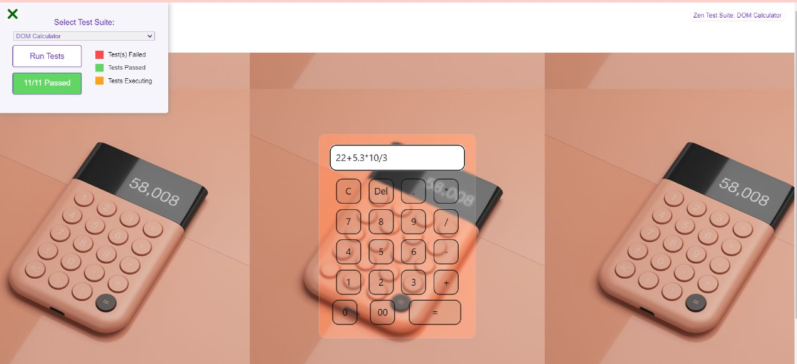

<h1>Calculator using DOM</h1>

To achieve the calculator layout & functions i used <b>Keyboard events</b>, function to perform mathematical operations. 
For style used bootstrap, html, css

<h3>Learned</h3>
<ul>
  <il>keyboard events</il>
   <il>eval</il>
   <il>slice method</il>
  <il>bootstrap classes</il>
</ul>
<h2>And my output will be</h2>

